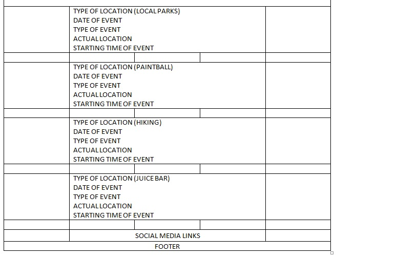
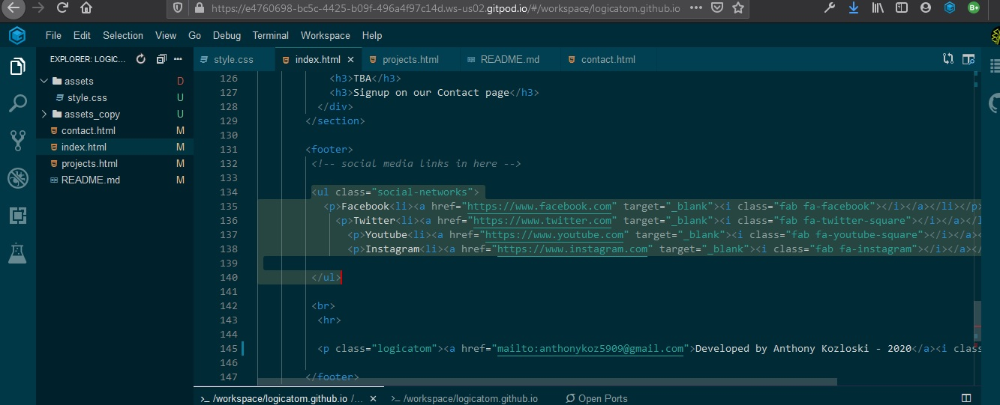

AK-MS1

This Milestone1 Project is a basic website of my portfolio

UX

I am looking to make the User Experience easy to process and understand, its that simple.

Existing Features

    Feature 1 - allows potential employers to achieve viewing my projects, by having them look through my site.

UX Design Writeup: Full screen resolution for desktop and laptop computers, and automatically adjusting screen resolutions for mobile devices using this code:
 @media screen and (max-width: 1393px) (Tablets)
 @media screen and (max-width: 943px) (mobile devices with large screens)
 @media screen and (max-width: 800px) (mobile devices with small screens)
 
 Below are screenshots of the Wireframes for the index page.
 
 

I designed the UX to function across most platforms including PC's, Iphones, Ipads, and Android tablets and smartphones, I did this because Code Institute requires it as a function for the UX Milestone, but also so that the website fits the screen of whichever platform is being used at the time.

Technologies Used:

HTML5 -- This project started out using just basic HTML but progressed into HTML5 and using CSS3. Back when this site was created CSS was just a thought, but now it is a real thing and I'm very happy to utilize it.  Using CSS has allowed me to call upon different classes and elements and I find that to be very useful to save time in the future.

    I cannot give a definite link to HTML5 because its like looking for who built the pyramids in ancient times, but here is a reference if you must have something:  <a href="https://en.wikipedia.org/wiki/HTML5">HTML5</a>

CSS3 = CSS3 was used throught the project and its origins again are vague as HTML5.. It might be apple, ibm, toshiba, lenovo, sony, microsoft, linux, arduino, python, hp...no one knows.  I am using CSS3 for this project as it provides functionality that I desire such as font size and types, as well as the ability to call upon libraries and other functions to accomplish almost everything including animations..thus replacing Adobe/Macromedia Flash as of December 2020.

    Yes I have done the proper research to figure that out, that Flash will end in 2020. Due to security issues. But in my opinion, Adobe wil unveil a new version of Flash with SSL security as soon as the old one retires. This use of simple CSS and HTML is pathetic in comparision to the potential of Flash. I feel like a kindergarten child in a college class when Flash is active.  Now knowing that Flash is retiring, I feel like a computer programmer expert inside of a kindergarten website land...aka...the real world.  it doesnt seem fair.  and it won't be like this for very long. don't be upset with me because i'm a forecaster.

    HTML5, CSS3, Bootstrap, Python3, iframes, responsive coding, form requirements.

    ++++++++++++++++++++++++++++++++++++++++++++++++++++++++++++++++++++++++++++++++++++++++++++
    
    The way this website has progressed is from the initial thought for it..i mean everyone needs a portfolio site. So i'm on the bandwagon now.  I will enjoy staying on focus to simplicity but also be unique.  I understand that Macromedia/Adobe Flash will end this year at Decemeber 2020, and its a real shame because Flash is amazing and nothing comes close..I think its end is due to jelousy of other companies.  After 2020, into 2021, Adobe will release a new ssl secure version of Flash that everyone has waiting on. 
    
   
++++++++++++++++++++++++++++++++++++++++++++++++++++++++++++++++++

Testing

I conducted testing after adding each element and after changing any code, numerous times. Tested on these browers: Firefox, Firefox Developer Edition, Google Chrome, Microsoft Edge, Safari
On these platforms:  Microsoft Windows, Google Chromebook, Android OS, Iphone OS.

All links have been tested and function, as well as all images, coding, form validation, css, UX, email link.

My UX provides easy navigation, a clean UX design, clean coding, and total functionality.

Scripts were not used in this project, it is total html and css from scratch.

        All user stories have been thoroughly tested and 100% functional.

This project looks and works on most devices and screen resolutions as well as minimizing and resizing browser windows.

Bugs Found during testing:
1. Social media links - the text and the links both split and changed from horizonal to vertical
2. Testing projects.html page using Firefox Developer Edition wouldn't refresh the page even while holding the SHIFT key. I used Google Chrome to ensure the COMMIT was successful - The COMMIT was successful.

Below is a screenshot of the Social Media bug on the index.html page

Deployment

This section should describe the process you went through to deploy the project to a hosting platform (e.g. GitHub Pages or Heroku).

Utilized GitHub Gitpod with extensions provided by Code Institute

In particular, you should provide all details of the differences between the deployed version and the development version, if any, including:

Initially used Repl.it, but considering the project requirments are to use GitHub I moved my basic code over then built upon it.

    Different values for environment variables (Heroku Config Vars)? No
    Different configuration files? didn't edit any config files
    Separate git branch?

Credits: Anthony Kozloski 

    Formdump provided by:
    https://formdump.codeinstitute.net/

    CSS icons provided by:
    fontawesome.com

Media

    The photos used in this site were obtained from:

    https://www.webworxtechnology.com/wp-content/uploads/2018/06/web-development.jpg
    https://www.tekshapers.com/uploads/blog_image/15362384091533896513blog-sco2.jpg
    https://pctechguides.com/wp-content/uploads/2016/06/web-development-in-2016-945x305.jpg
    https://d1.awsstatic.com/partner-network/QuickStart/aws-quickstart-graphic.2873d75db9a0414c1ca8fc41736b67f424e75e3a.png
    https://www.globalonlinepublishing.com/wp-content/uploads/2019/03/web-dev-Banner-008.jpg
    https://miro.medium.com/max/800/0*3TPL6NiHnvytCUMt
    https://media.istockphoto.com/photos/four-gears-in-hands-picture-id956463332?k=6&m=956463332&s=612x612&w=0&h=830lps6L-CgSnV2lzQcZzdTiFTf0LH0P2tsD1XpFR5Y=

This site is not for commercial use, it is explictly solely for the Code Institute MS1 Project assessors usage.

Acknowledgements

    I received inspiration for this project from Code Institute

*******************************
END MS1 PROJECT NOTES
*******************************

## Updates:

**September 25 2020:** Worked on Readme file and fixed some CSS errors.

**September 26 2020:** Final testing of UX and entire site as well as code validation.
